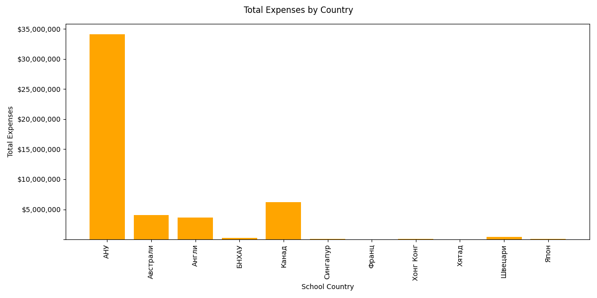

# IDS 706 Individual Project #1 

## Analysis on Education Assistant Program

Since early 2000s Mongolain government started providing education assistant programs to high school students who are accepted to the top 100 universities in the world. The government paid for all educational expenses including tuition, boarding etc. Per the program contract, students were expected to go back to Mongolia and work for at least 3 years after graduation. 

Recently, the high percentage of people who don't follow through with the contract obligation became a huge social issue in Mongolia. In this report, we take a look the what the mean, median of the student loan amounts were as well as the standard deviation 

    Mean: $117,340.00

    Median: $116,481.00

    Standard deviation: $54,692.00

On average, the mongolian government have provided $117K assistant to a student, the standard deviation being close to $55K. 

Most of the students who received this education assistantship program pursued higher education in the USA, whopping $35M were spent for USA alone. The second highest country was Canada, around $7M.

